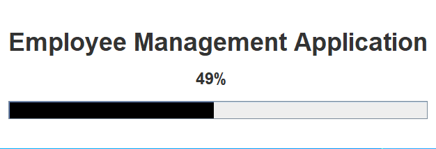
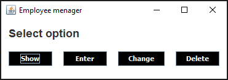
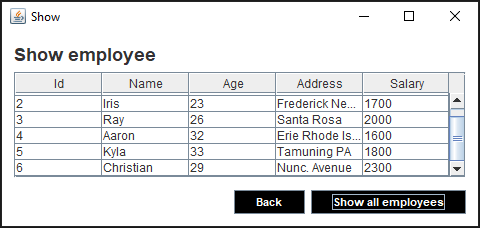
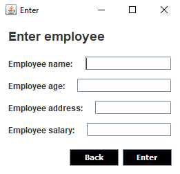
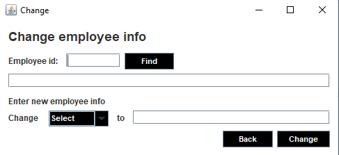
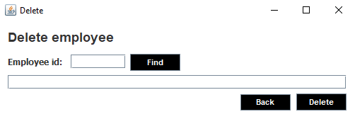

# Employee-management-app

Java based GUI desktop application for:
* listing all employees from database, 
* inserting new employees to database,
* changeing existing data with new data and 
* deleteting employees from database.

